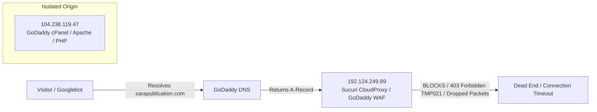

# 01 - Current Infrastructure Audit & Failure Analysis

## 1. Executive Summary
The primary domain `sarapublication.com` is completely unreachable to the public and de-indexed by Google search engines. The root cause is a misconfigured Web Application Firewall (WAF) proxy layer intercepting traffic before it reaches the origin web server.

---

## 2. IP & DNS Layer Mismatch

### Infrastructure Evidence
* **Domain Expiry**: March 30, 2029 (Domain is renewed and valid).
* **Current Public A-Record**: `192.124.249.89` (Sucuri / GoDaddy Firewall).
* **Actual Origin Host**: `104.238.119.47` (Host name: `ip-104-238-119-47.secureserver.net`).
* **Origin State**:
  * Port 80 & 443 are **OPEN** (`TcpTestSucceeded: True`).
  * Direct SNI request to origin returns `HTTP/1.1 200 OK` with full catalog HTML and active Apache PHP session (`PHPSESSID`).

---

## 3. Why Google De-Indexed the Domain
1. **Prolonged 403 & Timeout Responses**: Googlebot encountered continuous connection timeouts and `403 Forbidden` responses generated by Sucuri rule `TMP021` (Intrusion Detection System).
2. **Crawl Budget Eviction**: Search engines drop unresponsive domains to avoid delivering broken landing pages to users.
3. **Crawl Equity Leak**: Inbound citations from academic universities (AIIMS Nagpur, BLDE DU, NEHU, ResearchGate) are generating zero indexation value because destination endpoints fail to resolve.

---

## 4. Remediation Steps
1. In GoDaddy DNS Manager, update `@` (A-Record) value from `192.124.249.89` to `104.238.119.47`.
2. Confirm Let's Encrypt / cPanel AutoSSL cert is active on origin.
3. Submit domain re-verification in Google Search Console and request priority re-crawling.
