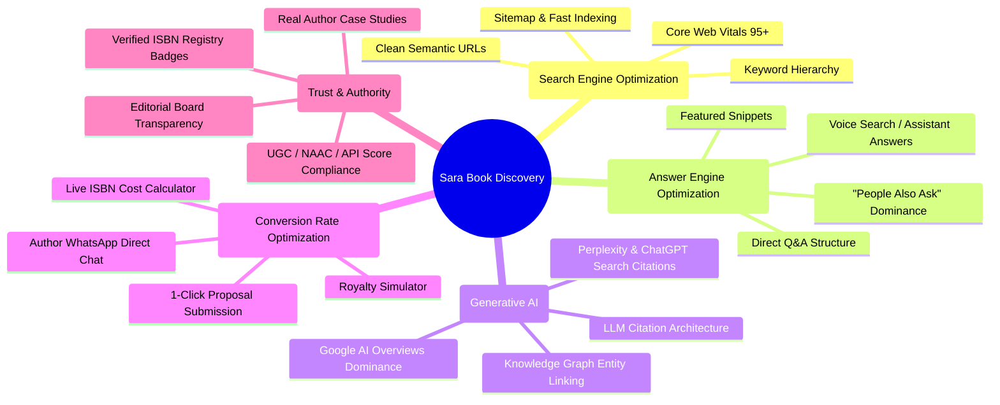

# 03 - Unified Optimization Strategy (SEO, AEO, GEO, AIO, SGE, CRO, EEAT)

Modern search is no longer just ten blue links on Google. This strategy outlines how **Sara Book Publication** will achieve maximum organic author acquisitions across all discovery engines.

---

## 1. The 7 Pillars of Optimization

---

## 2. Tactical Breakdown by Discipline

### A. SEO (Search Engine Optimization)
* **Title Tag Formula**: `[Book Title or Subject] | [UGC / ISBN Target] - Sara Book Publication`
* **Hierarchy Enforcement**: Single `<h1>` per page (Primary value prop), semantic `<h2>` for catalog streams, `<article>` for book summaries.
* **Canonical URLs**: Eliminate duplicate queries (`/view_all.php?subject=...` -> `/books/category/life-sciences`).

### B. AEO (Answer Engine Optimization)
* Structure key landing pages around direct author questions:
  * *"How does book publishing contribute to UGC API score for Assistant Professors?"*
  * *"What are the legal requirements for getting a valid 13-digit ISBN in India?"*
  * *"How long does academic book publication take with Sara Publication?"*
* Format answers in concise 40-50 word direct blocks with bulleted checklists for Google Featured Snippets.

### C. GEO / AIO / SGE (Generative AI Optimization)
* AI engines like Perplexity, ChatGPT Search, and Google AI Overviews cite sources with clear entity definitions and structured data.
* **Entity Mapping**: Link Sara Publication explicitly with Raja Rammohun Roy National Agency for ISBN, UGC-CARE list guidelines, and *Worldwide Journals*.
* **Format for LLMs**: Use clean markdown-style tables on the website outlining services, turnaround times, and editorial review processes.

### D. CRO (Conversion Rate Optimization)
* **Eliminate Friction**: Replace email attachments with an interactive multi-step submission stepper:
  1. Author & College Details
  2. Subject Selection & Book Title
  3. Manuscript / Synopsis Upload (PDF/Docx)
  4. Instant ISBN & Royalty Estimate
* **Trust Badges**: UGC-compliance guarantee, Raja Rammohun Roy National Agency for ISBN verification link, and author review carousel.

### E. EEAT (Experience, Expertise, Authoritativeness, Trust)
* Publish verified author profiles with ORCID IDs and Google Scholar links.
* Provide clear physical office address: 303, Maharana Pratap Complex, Paldi, Ahmedabad, with Google Maps embed and GST registration disclosure.
