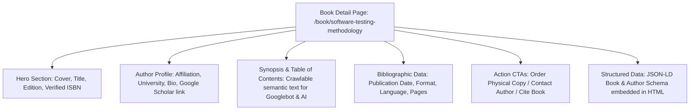

# 04 - Information Architecture & URL Routing Matrix

This document defines the new URL routing structure, page types, and entity relationships to replace legacy PHP query strings with semantic, high-ranking endpoints.

---

## 1. URL Migration Map

| Legacy PHP URL (Unoptimized) | Target Semantic Next.js URL | Primary Intent / Page Type |
| :--- | :--- | :--- |
| `https://sarapublication.com/` | `https://sarapublication.com/` | Homepage (Core Brand, Value Prop, Category Explorer) |
| `https://sarapublication.com/view_all.php?subject=LIFE_SCIENCES` | `https://sarapublication.com/books/life-sciences` | Category Catalog (Faceted Search & Filter) |
| `https://sarapublication.com/view_all.php?subject=MEDICAL_SCIENCE` | `https://sarapublication.com/books/medical-science` | Category Catalog |
| `https://sarapublication.com/view_all.php?subject=SCIENCES_AND_ENGINEERING`| `https://sarapublication.com/books/engineering` | Category Catalog |
| `https://sarapublication.com/view_all.php?subject=SOCIAL_SCIENCE_AND_HUMANITIES`| `https://sarapublication.com/books/humanities` | Category Catalog |
| *(Currently points directly to raw .jpg image)* | `https://sarapublication.com/book/[book-slug-isbn]` | Dedicated Book Detail Page (Rich Results & Purchase) |
| `https://sarapublication.com/author_guideline` | `https://sarapublication.com/guidelines/authors` | Author Guidelines & Submission Rules |
| `https://sarapublication.com/upload_book` | `https://sarapublication.com/publish/submit-proposal` | Interactive Manuscript Submission Portal |
| *(None - Missing)* | `https://sarapublication.com/services/isbn-allotment` | High-Intent SEO Landing Page for ISBN Services |
| *(None - Missing)* | `https://sarapublication.com/calculator/royalty-cost` | CRO Tool: Interactive ISBN & Royalty Calculator |
| `https://sarapublication.com/download` | `https://sarapublication.com/legal/terms` & `/privacy` | Legal Compliance |

---

## 2. Dedicated Book Detail Page Architecture

Every book currently links directly to an image file. The redesign establishes individual crawlable HTML pages for every published title:

