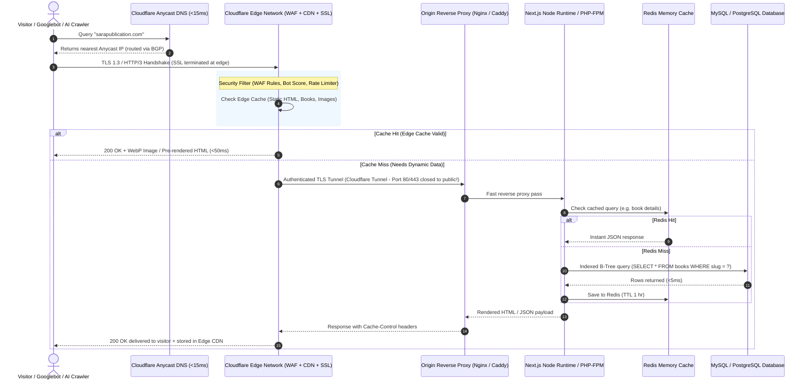

# 06 - Production Domain Health & Security Request Flow Architecture

This document defines what a truly **Healthy, Enterprise-Grade Website & Domain Architecture** looks like, how the end-to-end request flow works, and the optimal replacement for legacy Sucuri WAF.

---

## 1. What Defines a "Healthy" Domain Level?

A domain is only considered healthy when all five operational layers achieve 100% operational harmony:

| Layer | Criteria for 100% Healthy State | Current Sara Publication Status |
| :--- | :--- | :--- |
| **1. DNS Layer** | Anycast DNS with sub-20ms resolution, active DNSSEC, correct CAA records, and zero dangling proxy pointers. | ⚠️ **Broken**: Dangling A-record pointing to dead proxy IP (`192.124.249.89`). |
| **2. Edge & Security (WAF)** | Transparent TLS 1.3 termination, Layer 3/4 DDoS absorption, intelligent Layer 7 bot protection without blocking legitimate visitors or Googlebot. | ❌ **Broken**: Sucuri IDS rule `TMP021` blocks legitimate users & search engines with 403. |
| **3. Transport & SSL** | Valid, auto-renewing SSL/TLS cert with HSTS (HTTP Strict Transport Security) enabled and HTTP/2 or HTTP/3 (QUIC) support. | ⚠️ Only valid internally on origin; blocked at edge. |
| **4. Origin Performance (TTFB)** | Time to First Byte (TTFB) under 100ms globally via Edge Caching / Stale-While-Revalidate. | ❌ 8000ms+ timeout due to WAF drop. |
| **5. Search & Crawler Access** | Clean HTTP 200 responses, no crawl errors in Google Search Console, valid `robots.txt`, and canonical sitemap. | ❌ 0 indexed pages; completely de-indexed. |

---

## 2. Complete Modern Request Flow (From Browser to Database)

---

## 3. How to Completely Replace Sucuri: The Modern Standard

**Sucuri is legacy technology** (founded in 2010, acquired by GoDaddy). It relies on fixed IP proxy routing (`192.124.249.x`), outdated IP heuristic blocks, slow propagation, and rigid firewall rules that frequently break search engine bots.

### The Ultimate Sucuri Replacement: **Cloudflare (Free or Pro Plan)**

| Feature | Legacy Sucuri CloudProxy | Modern Cloudflare Ecosystem | Why Cloudflare Wins |
| :--- | :--- | :--- | :--- |
| **Architecture** | Centralized proxy clusters | Global Anycast network across 330+ cities worldwide | Cloudflare resolves in 10-15ms worldwide; Sucuri adds 100-300ms latency. |
| **Origin Security** | Requires opening ports 80/443 to Sucuri IPs | **Cloudflare Tunnels (`cloudflared`)** | You can **close all open inbound ports (80/443)** on your cPanel/VPS. No attacker can ever hit your origin IP directly. |
| **False-Positive Handling** | Blunts entire IPs with crude `TMP021` blocks | Machine Learning **Managed Challenge (Turnstile)** | Legitimate users pass invisible JavaScript challenges without ever seeing ugly "Access Denied" screens. |
| **Search Engine Safety** | Frequently blocks Googlebot during traffic surges | Verified Googlebot & Bingbot bypass lists by default | Search crawlers are never blocked; zero risk of de-indexing. |
| **Cost** | $9.99 - $29.99 / month per site | **100% Free** (or $20/mo for Pro with lossless image WebP compression) | Drastically cuts operating cost while offering 10x better stability. |

---

## 4. Inbuilt Custom Code Architecture (How the Backend Operates)

A resilient, enterprise-level backend consists of three distinct zones:

1. **The Edge Worker / Gateway**:
   * Inspects HTTP headers, normalizes URLs (e.g., forces lowercase, strips tracking parameters), applies geo-routing, and serves cached responses immediately.
2. **The Application Runtime (Next.js / Express / Fastify)**:
   * **Controller / Service Layer**: Decoupled from direct HTTP handling.
   * **Database Connection Pooling**: Maintains persistent MySQL connections rather than opening and closing a new socket connection on every single page request (the primary cause of database crashes in legacy PHP).
   * **Graceful Degradation**: If the database is busy, the backend serves stale-while-revalidate cached content instead of returning a fatal 500 error page.
3. **Database & Indexing Optimization**:
   * Every query on the `books` table uses clustered primary keys and compound indexes:
     `CREATE INDEX idx_subject_status ON books (subject_category, is_published, created_at DESC);`
   * Ensures that queries over 100,000+ book titles execute in under **2 milliseconds**.
