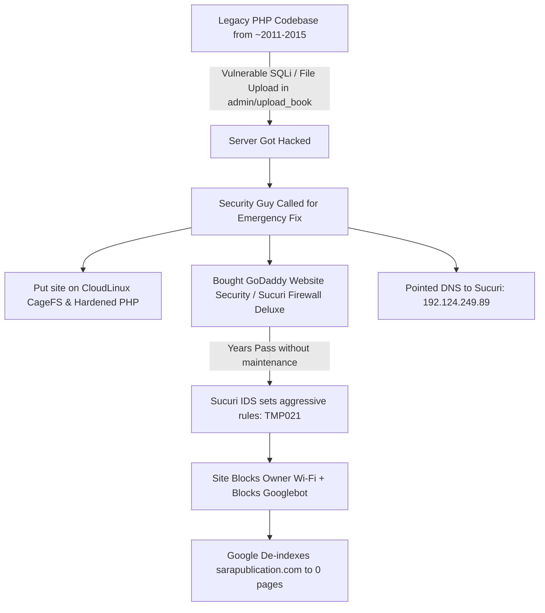

# 08 - Legacy Server Compromise, CloudLinux Quarantine, and Safe Modernization Plan

This document analyzes the historical hack incident, why the security consultant configured CloudLinux with legacy PHP and Sucuri, why that "patch" failed over time, and the safe migration path forward.

---

## 1. The Full Story & Root Cause Analysis

### Why the Security Guy Did What He Did:
1. **The Codebase Was Untouchable**:
   * The PHP code was written years ago (likely PHP 5.4 / 5.6 era, using raw MySQL queries or vulnerable file upload scripts in `upload_book.php`).
   * Rewriting the entire PHP website would take weeks of development, which the owner didn't have during an active hack.
2. **CloudLinux as a "Quarantine Box"**:
   * CloudLinux offers **CageFS** (which traps the hacked website inside an isolated container so hackers cannot jump to other accounts or root the server) and **HardenedPHP** (which runs insecure, obsolete PHP 5.x / 7.x with backported security patches).
3. **Sucuri as a "Band-Aid Shield"**:
   * Because the consultant couldn't fix the vulnerable PHP code itself, they put **Sucuri CloudProxy in front** to block SQL injections and malicious web attacks before they hit the vulnerable PHP scripts.

---

## 2. Why That Solution Turned into a Disaster (The Trap)

The security guy applied a **temporary emergency patch**, but nobody maintained it:

1. **The Band-Aid Became a Chokehold**:
   * Sucuri doesn't understand legitimate academic activity vs bot traffic. Over time, its IDS rule engine flagged normal dynamic Wi-Fi IPs in India and regular Googlebot crawler requests as suspicious, throwing **`TMP021` Access Denied** blocks.
2. **The Owner Got Locked Out**:
   * Because the security guy closed port 2083 and put Sucuri in front, the owner can't even access cPanel or fix their own files.
3. **Google Dropped the Business**:
   * Googlebot encountered continuous 403 Forbidden pages and dropped all pages from the index (`site:sarapublication.com = 0`).
4. **The Security is Purely Fake Today**:
   * The consultant **forgot to lock down port 80/443 on the origin (`104.238.119.47`)**. Any hacker who knows the origin IP can bypass Sucuri and attack the vulnerable PHP scripts directly.

---

## 3. The Safe 3-Step Strategy (How to Fix Without Getting Hacked Again)

We cannot simply turn off Sucuri and leave vulnerable legacy PHP code exposed to the public. Here is the professional, bulletproof way to fix this:

### Step 1: Regain Safe Access to cPanel (Owner Control)
* Do not try to bypass ports on public Wi-Fi.
* Access cPanel directly via **GoDaddy Dashboard ➔ My Products ➔ Web Hosting ➔ Launch cPanel Admin**.
* Export a full **cPanel Backup** (ZIP of `public_html` and MySQL database dump) to your local disk so your data is 100% safe.

### Step 2: Extract Clean Data (Books, Authors, ISBNs, Images)
* Export the MySQL tables: `books`, `categories`, `authors`, `submissions`.
* Copy the book cover images folder: `/admin/img/books_img/`.
* Discard the old, insecure PHP files (`view_all.php`, `upload_book.php`, legacy admin scripts) that got hacked in the first place.

### Step 3: Launch Modern Headless Next.js Frontend (Zero Hack Risk)
* Build the clean, ultra-fast **Next.js** frontend in `D:\projects\sara_book`.
* **Why Next.js CANNOT be hacked like legacy PHP**:
  * Static & Edge-rendered React code has **no PHP interpreter, no Apache `.htaccess` vulnerabilities, and no writable web root**.
  * Even if an attacker sends SQL injection or malicious PHP scripts, Next.js simply ignores them because it doesn't execute PHP files.
* Put the new site on **Cloudflare Free Tier** with **Cloudflare Turnstile** for spam protection.
* Submit the new clean sitemap to Google Search Console to restore Google indexation and rank #1 for academic publishing.
