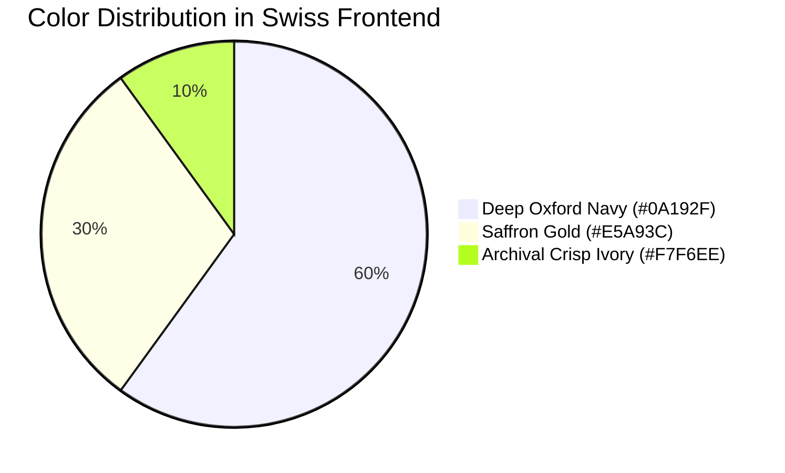

# 09 - Swiss Typographic & Noma Bar Gestalt Design System Implementation

This document specifies the visual engineering language applied to **Sara Book Publication**, transmuting the academic marketing prompt into a high-converting, authoritative web design system.

---

## 1. The 3-Color Strict Harmony Matrix

| Token Name | Hex Code | Visual Role & Psychological Impact |
| :--- | :--- | :--- |
| **Dominant Base (60%)** | `#0A192F` (Deep Oxford Navy) | Delivers instant institutional gravitas, academic authority, and high-contrast legibility for medical doctors and university faculty. |
| **Sacred/Accent (30%)** | `#E5A93C` (Saffron Gold) | Guides the author's eye directly to conversion touchpoints: *UGC ISBN Validated, 48hr Fast-Track Review, 10 API Points*. |
| **Active Contrast (10%)** | `#F7F6EE` (Archival Crisp Ivory) | Replaces harsh digital white (#FFFFFF) with the tactile aesthetic of premium archival academic book paper. |

---

## 2. Core Architectural Pillars

### 1. Josef Müller-Brockmann Asymmetric Swiss Grid
* **Typography**: Heavy, un-embellished Swiss Sans-Serif (`Helvetica Neue` / `Akzidenz-Grotesk`) paired with mathematical monospaced metadata badges.
* **Layout**: 12-column asymmetric alignment. Headlines occupy 7 columns on the left; the optical focal poster anchors 5 columns on the right.

### 2. Noma Bar Gestalt Negative Space Continuity
* **The Negative Space Anchor**: The visual poster utilizes negative space cutouts where the physical shape of a book page silhouettes the nib of a fountain pen (`#0A192F` cut into `#F7F6EE`).
* **Micro-details**: Sharp architectural edges, border-first geometry (`border-2 border-[#0A192F]`), zero soft drop-shadows, and zero artificial gradients.

### 3. Academic Funnel Conversion Architecture
* **Spec Sheet Cards**: Replaces generic e-commerce product cards with archival specification sheets showcasing registered ISBNs, page counts, and DOI badges.
* **Instant Proposal Triggers**: Clear, high-contrast action CTAs for fast-track manuscript submissions.
