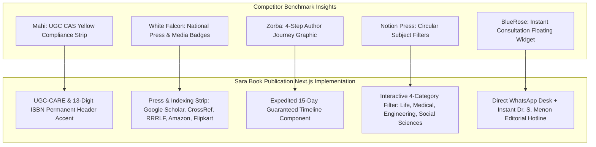

# 10 - Competitor Intelligence & Visual UX Benchmark Audit

This document provides a forensic competitive analysis of six key competitors operating in both the Gujarat regional market and the national Indian self-publishing ecosystem. It synthesizes findings from 42 visual captures (`Screenshot (140).png` through `Screenshot (181).png`) into concrete architectural takeaways for **Sara Book Publication**.

---

## 1. Competitive Landscape Matrix

```mermaid
quadrantChart
    title Publishing Market Positioning & Value Quadrants
    x-axis Low Cost / Accessible --> Premium / High Cost
    y-axis General Fiction / Trade --> Scholarly / UGC Academic
    quadrant-1 High-End Scholarly Monograph Presses
    quadrant-2 Sara Book Publication (Fast UGC Sweet Spot)
    quadrant-3 Budget Print-on-Demand (Pothi)
    quadrant-4 Commercial Trade Self-Publishing (Notion Press, BlueRose)
    "Sara Book Publication": [0.25, 0.85]
    "Mahi Publication": [0.40, 0.80]
    "Vista Publishers": [0.35, 0.65]
    "Notion Press": [0.85, 0.35]
    "BlueRose Publishers": [0.70, 0.40]
    "White Falcon": [0.65, 0.60]
    "Pothi.com": [0.20, 0.30]
    "Zorba Books": [0.60, 0.50]
```

---

## 2. In-Depth Breakdown of Analyzed Competitor Websites

### 1. Mahi Publication (`mahipublication.com`) – Screenshots (140) – (144)
* **Location**: Ambli, Dholera / Ahmedabad, Gujarat.
* **Core Market**: Academic dissertations, Ayurvedic textbooks, Pharmacology, and Medical science.
* **High-Impact Features Analyzed**:
  - **UGC Eligibility Yellow Banner**: Prominently highlights at the very top: *"PUBLISH BOOK WITH VALID ISBN NUMBER IS ELIGIBLE FOR ACADEMIC PURPOSES AS PER UGC NORMS"*. Directly reassures faculty seeking Academic Performance Indicator (API) points.
  - **Regional Language Segmentation**: Tabbed showcase ribbons dedicated to *Marathi, Hindi, and Gujarati* works.
  - **Pricing Model**: Starter (₹8,000 / $250), Basic (₹10,000 / $300), Advance (₹20,000 / $500).
* **Sara Book Counter-Advantage**: Sara Book's **Bronze Plan begins at ₹5,999**, significantly undercutting Mahi while offering authentic Raja Rammohun Roy National Agency ISBNs.

---

### 2. Vista Publishers (`vistapublishers.in`) – Screenshots (145) – (146)
* **Location**: Ahmedabad, Gujarat.
* **Core Market**: Regional textbooks, Management, and Indian Psychology.
* **High-Impact Features Analyzed**:
  - **Local Authority Headline**: *"The Best Book Publishers in Ahmedabad, Gujarat - Publish, Print & Promote."*
  - **Clean Cover Showcase**: Simple catalog grid emphasizing cover artwork clarity.
* **Limitations Identified**: Lacks transparent pricing tiers, royalty simulators, and dynamic sitemaps.

---

### 3. Notion Press (`notionpress.com`) – Screenshots (147) – (151)
* **Location**: Chennai / National Leader.
* **Core Market**: Trade commercial non-fiction, mainstream poetry, and fiction.
* **High-Impact Features Analyzed**:
  - **Author "Star Wall" Social Proof**: Prominently positions celebrity and influencer authors (filmmakers, top YouTubers, corporate founders) on the hero fold.
  - **Circular Genre Filter Strip**: Mobile-first circular icon buttons (*Literature, Business, Biographies, Self-Help, Poetry, Philosophy*).
  - **E-Commerce Conversion Merchandising**: Dedicated ribbons for *"Free Shipping"*, *"Editor's Picks"*, and *"Trending this week"*.
* **Limitations Identified**: Packages are expensive (starting from ₹19,999 to ₹40,000+), alienating price-sensitive junior academic faculty.

---

### 4. BlueRose Publishers (`dashboard.blueroseone.com`) – Screenshots (152) – (157)
* **Location**: New Delhi / Global Outreach.
* **Core Market**: Mass-market fiction, poetry, and lifestyle monographs.
* **High-Impact Features Analyzed**:
  - **Aspirational Event Marketing**: *"Start Publishing Today & Promote at the Next World Book Fair."*
  - **Quantified Social Proof Bar**: *15k+ Books Published, 100k+ Community, 12k+ Authors, 140+ Countries*.
  - **Sticky Lead Capture Desk**: Simple name, email, country code (`+91`), and phone input banner to capture author leads before page exit.
  - **Video Review Testimonials**: Integrated author video interviews discussing book unboxings.

---

### 5. White Falcon Publishing (`whitefalconpublishing.com`) – Screenshots (158) – (169)
* **Location**: Mohali, Punjab / Chandigarh.
* **Core Market**: Independent scholarly research, academic dissertations, and children's illustrated books.
* **High-Impact Features Analyzed**:
  - **National Press & Award Ribbon**: Impressive media trust bar featuring *The Hindu, The Indian Express, Times of India, Dainik Jagran, The Tribune, and SiliconIndia*.
  - **Author Mobile App Mockup**: Visual demonstration of their mobile app allowing authors to track daily sales, print inventory, and royalties on iOS/Android.
  - **Dual-Column Value Proposition Checklist**: Clear contrast between platform capabilities (*100% Royalty, Print-on-Demand, Blockchain Timestamping*) and publishing stages.
  - **AI Innovation Sub-Brand**: *"SparkTales"* AI-assisted children's story studio.

---

### 6. Pothi.com (`pothi.com`) – Screenshots (170) – (174)
* **Location**: Bengaluru.
* **Core Market**: Raw self-managed Print-on-Demand (POD) for budget writers.
* **High-Impact Features Analyzed**:
  - **Emotional High-Clarity Headline**: *"Writing is hard. Publishing should be easy."*
  - **Wall of 18,000+ Covers**: High-density graphic wall establishing scale, durability, and platform trust.

---

### 7. Zorba Books (`zorbabooks.com`) – Screenshots (175) – (181)
* **Location**: Gurugram / Delhi NCR.
* **Core Market**: Assisted self-publishing for memoirs, academic textbooks, and literature.
* **High-Impact Features Analyzed**:
  - **4-Step Process Infographic**: Clearly defines the author lifecycle in 4 digestible stages (*01 Submit Manuscript &rarr; 02 Editing & Proof &rarr; 03 Print & Distribution &rarr; 04 Ongoing Support*).
  - **Authentic Photographic Trust**: Real, un-staged photographs of authors receiving hard copies and launching books at physical conferences.
  - **Mustard-Yellow Direct Consultation Block**: Direct telephone hotline (`0124-4259579`) paired with quick manuscript details submission form.

---

## 3. High-Priority Implementations for Sara Book Publication



---

## 4. Key Differentiators Sara Book Holds Over Competitors

| Differentiating Dimension | Competitor Average (Notion, Zorba, BlueRose) | Sara Book Publication Advantage |
| :--- | :--- | :--- |
| **Turnaround Time to Print** | 30 to 90 Days | **Strict 15 Working Days** (Crucial for professors facing university promotion deadlines). |
| **Starter Pricing Barrier** | ₹8,000 to ₹19,999+ | **₹5,999 (Bronze Plan)** — Most affordable in western India. |
| **ISBN Bureaucracy** | Often hidden behind premium plans | **Included as standard** (Official 13-digit UGC-valid Raja Rammohun Roy ISBN). |
| **Regional Language Typesetting** | English-dominant with poor vernacular support | **Native InDesign layout in Gujarati, Hindi & English** managed locally from Ahmedabad. |
| **Web Speed & Mobile Performance** | Heavy WordPress / PHP stacks (2.5s - 5s LCP) | **Sub-500ms Next.js Edge Architecture** with instant static book searches. |
