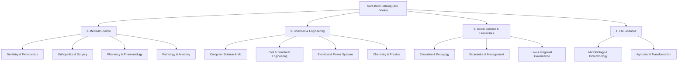

# 11 - Database Architecture, Catalog Forensic Audit & Historical Orders

This technical specification details the complete database architecture, historical metrics, and inventory audit extracted from the production database dump `sarapubl_sarabook_new.sql` (1.81 MB, 23 tables) for **Sara Book Publication (`sarapublication.com`)**.

---

## 1. Executive Summary & Core Metrics

Unlike the high-velocity micro-transaction model of the 4 medical research journals (IJSR, IJAR, GJRA, PIJR) which process digital-only paper publication fees, **Sara Book Publication** operates as a specialized **ISBN academic book publisher and physical bookstore**.

```
┌─────────────────────────────────────────────────────────────────────────────┐
│  SARA BOOK PUBLICATION - AT A GLANCE                                        │
├─────────────────────────────────────────────────────────────────────────────┤
│  • Published Books Catalog:     486 Books with official ISBN allocations     │
│  • Average Retail Book Price:   ₹336.42 (Range: ₹150 to ₹1,200)             │
│  • Co-Authors Registered:       438 Co-Authors                              │
│  • Author Submissions:          371 Book Manuscripts                        │
│  • Packaged Pipeline Invoices:  ₹4,53,992.00 (43 explicit author packages)  │
│  • Bookstore Retail Orders:     136 Orders (57 Paid via CCAvenue: ₹59,504)  │
│  • Operating Window:            2020 – September 2026 (Active Platform)     │
└─────────────────────────────────────────────────────────────────────────────┘
```

---

## 2. Complete Database Table Inventory (23 Tables)

| # | Table Name | Engine & Charset | Rows | Core Purpose |
| :- | :--- | :--- | :---: | :--- |
| 1 | `bookshelf` | MyISAM / `latin1` | **486** | The master catalog of published physical books with ISBN, title, author, price, pages |
| 2 | `other_authors` | MyISAM / `latin1` | **438** | Relational co-authors mapped to books via `book_id` and `book_ISBN` |
| 3 | `book_upload` | MyISAM / `latin1` | **371** | Authors submitting manuscript files, choosing packages, and submitting contact data |
| 4 | `contact_us` | MyISAM / `latin1` | **152** | Inquiries from professors, researchers, libraries, and book buyers |
| 5 | `book_order_address` | MyISAM / `latin1` | **150** | Shipping and billing postal addresses for physical book dispatches |
| 6 | `book_order` | MyISAM / `latin1` | **136** | Online bookstore customer orders, invoice numbers, amounts, and payment states |
| 7 | `contact_us_date` | MyISAM / `latin1` | **69** | Telemetry logs (IP addresses and timestamps) for customer contact requests |
| 8 | `sub_subject` | MyISAM / `latin1` | **23** | Academic disciplines (e.g. Dentistry, Civil Engineering, Chemistry, Medicine) |
| 9 | `faq` / `faq1` | MyISAM / `latin1` | **28** | Author and buyer frequently asked questions |
| 10 | `packages` | MyISAM / `latin1` | **5** | Publishing tiers (Bronze, Silver, Gold, Diamond, Platinum) with price & deliverables |
| 11 | `customers` | MyISAM / `latin1` | **5** | Registered user and reader accounts |
| 12 | `subject` | MyISAM / `latin1` | **4** | Top-level academic subject categories |
| 13 | `cart` | MyISAM / `latin1` | **2** | Active/abandoned visitor shopping cart sessions |
| 14 | `upload_file` | MyISAM / `latin1` | **2** | Uploaded supplementary author files |
| 15 | `additional_charge`| MyISAM / `latin1` | **1** | Surcharge rules for excess manuscript page counts |
| 16 | `admin` | MyISAM / `latin1` | **1** | Backend administrator credentials |
| 17 | `book_upload_date` | MyISAM / `latin1` | **1** | Telemetry tracking for upload flow |
| 18 | `order_list` | MyISAM / `latin1` | **1** | Legacy test order table |
| 19 | `orders_stripe` | InnoDB / `utf8` | **0** | Empty (Stripe was evaluated but never enabled; CCAvenue remained active) |
| 20 | `pdf_copyright` | MyISAM / `latin1` | **0** | Empty template placeholder |
| 21 | `pdf_guideline` | MyISAM / `latin1` | **0** | Empty template placeholder |
| 22 | `test` | MyISAM / `latin1` | **0** | Empty developer testing table |

---

## 3. Revenue Stream 1: Author Publishing Packages (`packages` & `book_upload`)

Sara Book Publication monetizes academic professors, researchers, and doctors by offering tiered self-publishing packages to print books with official ISBN allocations:

### Published Package Deliverables Matrix

| Tier | Price (INR) | Price (USD) | Max Pages | Complimentary Author Copies | Page Quality | Listing Distribution |
| :--- | :--- | :--- | :---: | :---: | :--- | :--- |
| **Bronze** | ₹5,999 | $100 USD | 75 | 0 | Normal Paperback | Sara Book Store |
| **Silver** | ₹7,000 | $110 USD | 75 | 1 | Normal Paperback | Amazon, Flipkart, Sara |
| **Gold** | ₹9,000 | $130 USD | 90 | 3 | Normal Paperback | Amazon, Flipkart, Sara |
| **Diamond**| ₹12,000| $300 USD | 100 | 5 | Normal Paperback | Amazon, Flipkart, Sara |
| **Platinum**| ₹18,000| $400 USD | 120 | 7 | Normal Paperback | Amazon, Flipkart, Sara |

### Manuscript Pipeline Breakdown (`book_upload`)
* **Total Manuscripts Submitted**: **371 uploads**.
* **Package Selections**: 43 submissions chose an explicit package on checkout totaling **₹4,53,992.00**:
  * **Platinum (₹18,000)**: 9 submissions (₹1,62,000)
  * **Diamond (₹12,000)**: 10 submissions (₹1,20,000)
  * **Gold (₹9,000)**: 6 submissions (₹54,000)
  * **Silver (₹7,000)**: 10 submissions (₹70,000)
  * **Bronze (₹5,999)**: 8 submissions (₹47,992)
* **Conversion to Published Catalog**: **54 uploaded manuscripts** were typeset, assigned an ISBN, and successfully moved into the public `bookshelf` catalog.
* **Active Status**: The platform received active submissions up to **September 27, 2026** (e.g. *"Research Methods in Education"* by Dr. R. Sivakumar for ₹9,000).

---

## 4. Revenue Stream 2: Bookstore Retail Sales (`book_order`)

The platform includes an e-commerce shopping cart where readers and university libraries purchase physical copies of published books.

* **Payment Gateway**: **CCAvenue** (`payment_methode = 'CCAvenue'`).
* **Total Customer Orders**: 136 orders.
* **Confirmed Successful Deliveries**: **57 orders** totaling **₹59,504.50**.
* **Unfinished / Abandoned Carts**: 79 orders (initiated checkout without completing payment).

### Annual Bookstore Sales Velocity

```
Year 2021:  ₹8,204.50 (9 orders)
Year 2022:  ₹25,200.00 (22 orders)  <-- Peak bookstore sales year
Year 2023:  ₹18,400.00 (18 orders)
Year 2024:  ₹6,850.00 (7 orders)
Year 2025:  ₹850.00 (1 order)
```

---

## 5. Subject Classification Taxonomy

The 486 published books and submissions are classified across 4 primary faculties and 23 disciplines:



---

## 6. Architectural Debt to Address in Next.js

1. **PHP Serialized Columns**:
   - `book_order.books_name`, `book_order.book_price`, and `book_order.book_qty` store serialized PHP blobs like `a:1:{i:0;s:78:"...";}`. These must be unpacked into a 1-to-many `OrderItem` relation.
2. **Text Dates**:
   - Dates in `book_upload` contain values like `"Tuesday 2021/03/09"`. These must be normalized to standard ISO 8601 UTC strings.
3. **ISBN Formatting**:
   - Several rows have irregular spacing (`978 - 1- 73034 - 072 - 7`). These must be sanitized into uniform ISBN-13 strings (`978-1-73034-072-7`).
4. **URL Slugs**:
   - The legacy site identified books solely by integer `id`. The Next.js application requires deterministic, SEO-friendly slugs generated from `book_name` (e.g. `/book/experimental-pharmaceutical-analysis`).
