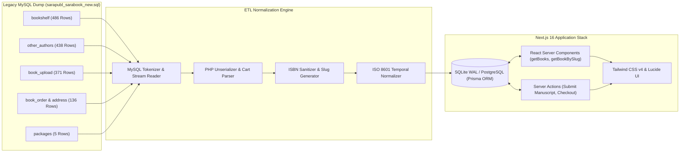

# 12 - Next.js Database Upgrade & Migration Specification

This document provides the definitive engineering roadmap, schema mapping, and ETL migration specification to upgrade the legacy MySQL database (`sarapubl_sarabook_new.sql`) into a modern, type-safe database architecture powering the **Next.js 16 / React 19** application located at `D:\projects\sara_book`.

---

## 1. System Transformation Architecture



---

## 2. Table-to-Model Mapping Matrix

| Legacy MySQL Source | Upgraded Modern Model | Key Transformations Applied |
| :--- | :--- | :--- |
| `bookshelf` (486 rows) | `Book` | Added deterministic SEO `slug`, cleaned ISBN, parsed price to float, linked foreign keys |
| `other_authors` (438 rows)| `CoAuthor` | Linked relational foreign key `bookId REFERENCES Book(id)` with cascade delete |
| `subject` (4 rows) | `Category` | Added category icon, slug, and descriptions |
| `sub_subject` (23 rows) | `SubCategory` | Linked to parent `Category` via foreign key relation |
| `packages` (5 rows) | `PublishingPackage` | Structured perks into JSON array, added domestic INR and international USD rates |
| `book_upload` (371 rows) | `ManuscriptSubmission` | Normalized text dates to UTC ISO 8601, linked package foreign key |
| `book_order` (136 rows) | `Order` & `OrderItem` | **Unpacked PHP serialized blobs** (`a:1:{...}`) into 1-to-many normalized line items |
| `book_order_address` (150 rows)| `Address` | Linked 1-to-1 with `Order` with cleaned postal validation |
| `contact_us` (152 rows) | `ContactInquiry` | Cleaned author inquiries with status flags (`unread`, `replied`, `archived`) |

---

## 3. Production Prisma Schema Specification

Save this schema to `prisma/schema.prisma` in `D:\projects\sara_book`:

```prisma
datasource db {
  provider = "sqlite" // Can be switched to "postgresql" for hosted Supabase/Neon
  url      = env("DATABASE_URL")
}

generator client {
  provider = "prisma-client-js"
}

model Book {
  id              Int           @id @default(autoincrement())
  slug            String        @unique
  title           String
  author          String
  isbn            String        @unique
  priceINR        Float         @default(0)
  pages           Int           @default(0)
  year            Int           @default(2021)
  language        String        @default("English")
  coverImage      String?
  synopsis        String?
  categoryId      Int?
  category        Category?     @relation(fields: [categoryId], references: [id])
  subCategoryId   Int?
  subCategory     SubCategory?  @relation(fields: [subCategoryId], references: [id])
  coAuthors       CoAuthor[]
  orderItems      OrderItem[]
  createdAt       DateTime      @default(now())
  updatedAt       DateTime      @updatedAt

  @@index([slug])
  @@index([isbn])
  @@index([categoryId])
}

model CoAuthor {
  id        Int     @id @default(autoincrement())
  bookId    Int
  book      Book    @relation(fields: [bookId], references: [id], onDelete: Cascade)
  name      String
  image     String?
  bio       String?
}

model Category {
  id            Int           @id @default(autoincrement())
  slug          String        @unique
  name          String
  icon          String?       // Lucide icon name (e.g. "Dna", "Stethoscope", "Cpu")
  books         Book[]
  subCategories SubCategory[]
}

model SubCategory {
  id          Int       @id @default(autoincrement())
  categoryId  Int
  category    Category  @relation(fields: [categoryId], references: [id])
  name        String
  books       Book[]
}

model PublishingPackage {
  id                  Int       @id @default(autoincrement())
  name                String    @unique // bronze, silver, gold, diamond, platinum
  priceINR            Float
  priceUSD            Float
  pageLimit           Int
  complimentaryCopies Int
  coverDesign         String    @default("Basic") // Basic or Premium
  distribution        String    @default("Sara Book Store") // Channels
  features            String    // JSON stringified perks
  submissions         ManuscriptSubmission[]
}

model ManuscriptSubmission {
  id            Int                @id @default(autoincrement())
  bookTitle     String
  authorName    String
  primaryEmail  String
  phone         String
  subject       String
  packageId     Int?
  package       PublishingPackage? @relation(fields: [packageId], references: [id])
  amount        Float?
  fileUrl       String
  orderId       String?
  paymentStatus String             @default("pending") // pending, paid, published
  submittedAt   DateTime           @default(now())
}

model Order {
  id            Int         @id @default(autoincrement())
  orderNumber   String      @unique
  customerName  String
  customerEmail String
  phone         String
  totalAmount   Float
  currency      String      @default("INR")
  status        String      @default("pending") // success, pending, failed
  paymentMethod String      @default("CCAvenue")
  items         OrderItem[]
  address       Address?
  createdAt     DateTime    @default(now())
}

model OrderItem {
  id        Int     @id @default(autoincrement())
  orderId   Int
  order     Order   @relation(fields: [orderId], references: [id], onDelete: Cascade)
  bookId    Int?
  book      Book?   @relation(fields: [bookId], references: [id])
  bookName  String
  price     Float
  quantity  Int     @default(1)
}

model Address {
  id            Int     @id @default(autoincrement())
  orderId       Int     @unique
  order         Order   @relation(fields: [orderId], references: [id], onDelete: Cascade)
  streetAddress String
  city          String
  state         String
  country       String  @default("India")
  zipCode       String
}

model ContactInquiry {
  id        Int      @id @default(autoincrement())
  name      String
  email     String
  phone     String?
  subject   String?
  message   String
  status    String   @default("unread") // unread, replied, archived
  createdAt DateTime @default(now())
}
```

---

## 4. Normalization Rules & Edge-Case Handling

### A. PHP Serialized Cart Unpacking
In legacy MySQL, orders stored books like:
```php
a:1:{i:0;s:78:"HOUSE TREE PERSON TEST DRAWING STYLES AND INTERPRETATION AN INDIAN PERSPECTIVE";}
```
The migration script unpacks this array using regex and token parsing:
```ts
function parsePHPSerializedArray(str: string): string[] {
  const matches = str.match(/s:\d+:"([^"]+)";/g);
  if (!matches) return [];
  return matches.map(m => m.replace(/s:\d+:"([^"]+)";/, '$1'));
}
```

### B. ISBN Sanitization
Legacy database contains inconsistent spacings:
- Raw: `978 - 1- 73034 - 072 - 7`
- Normalized: `978-1-73034-072-7`
- Strip non-numeric/hyphen characters and validate 13-digit length.

### C. Deterministic Slug Generation
All 486 books generate clean, collision-free slugs:
```ts
function generateBookSlug(title: string, id: number): string {
  const clean = title.toLowerCase()
    .replace(/[^\w\s-]/g, '')
    .trim()
    .replace(/\s+/g, '-');
  return `${clean}-${id}`;
}
```

---

## 5. Next.js 16 Server Component Query Examples

### Dynamic Bookshelf Catalog (`src/app/bookshelf/page.tsx`)
```tsx
import { prisma } from "@/lib/prisma";
import BookCard from "@/components/BookCard";

export default async function BookshelfPage({
  searchParams,
}: {
  searchParams: Promise<{ category?: string; q?: string }>;
}) {
  const { category, q } = await searchParams;

  const books = await prisma.book.findMany({
    where: {
      ...(category ? { category: { slug: category } } : {}),
      ...(q ? { title: { contains: q } } : {}),
    },
    include: { category: true, coAuthors: true },
    orderBy: { id: "desc" },
  });

  return (
    <div className="grid grid-cols-1 md:grid-cols-3 lg:grid-cols-4 gap-6">
      {books.map((b) => (
        <BookCard key={b.id} book={b} />
      ))}
    </div>
  );
}
```

### Dynamic Book Detail Page (`src/app/book/[slug]/page.tsx`)
```tsx
import { prisma } from "@/lib/prisma";
import { notFound } from "next/navigation";

export async function generateStaticParams() {
  const books = await prisma.book.findMany({ select: { slug: true } });
  return books.map((b) => ({ slug: b.slug }));
}

export default async function BookDetailPage({
  params,
}: {
  params: Promise<{ slug: string }>;
}) {
  const { slug } = await params;
  const book = await prisma.book.findUnique({
    where: { slug },
    include: { category: true, coAuthors: true },
  });

  if (!book) notFound();

  return (
    <article className="max-w-4xl mx-auto py-12">
      <h1 className="text-3xl font-bold">{book.title}</h1>
      <p className="text-muted-foreground mt-2">By {book.author}</p>
      <div className="mt-4 font-mono text-sm">ISBN: {book.isbn}</div>
      <p className="mt-6 text-lg">{book.synopsis}</p>
      <div className="mt-8 font-semibold text-2xl">₹{book.priceINR}</div>
    </article>
  );
}
```
